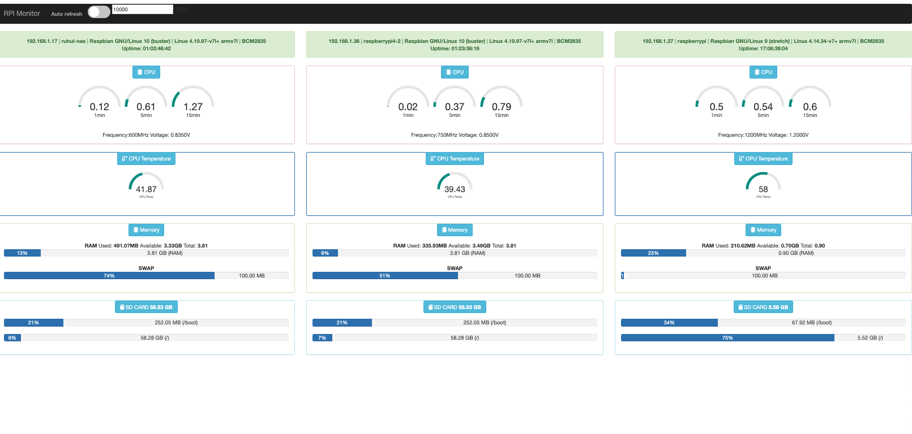

# rpimonitor-addons

rpimonitor - multiple raspberry pi

## Problem  
>Wanted to monitor my multiple raspberry pi in one dashboard.

## Solution 
> rpimonitor is very good application that can be used to monitor raspberry but could not find a way to view all my raspberry pi in same dashboard. As a work around replace the addons.html file in rpimonitor app with my version of dashboard which connect to all my raspberry pi and show them in a dashboard.

**Prerequisite :**  rpimonitor should be install in all the raspberry. 
Refer ([https://github.com/XavierBerger/RPi-Monitor](https://github.com/XavierBerger/RPi-Monitor))

##Steps :
- ```sudo mv /usr/share/rpimonitor/web/addons.html /usr/share/rpimonitor/web/addons.html-back ```
-  ```sudo cp addons.html /usr/share/rpimonitor/web/```

This will take a backup of original addons.html and copy this addons.html to the location. Now access the addons page 
>http://:8888/addons.html

>**Issue:** Since it connects to other raspberry pi , browser will not allow because of COORS. Need to disable COORS in browser to access the data.

